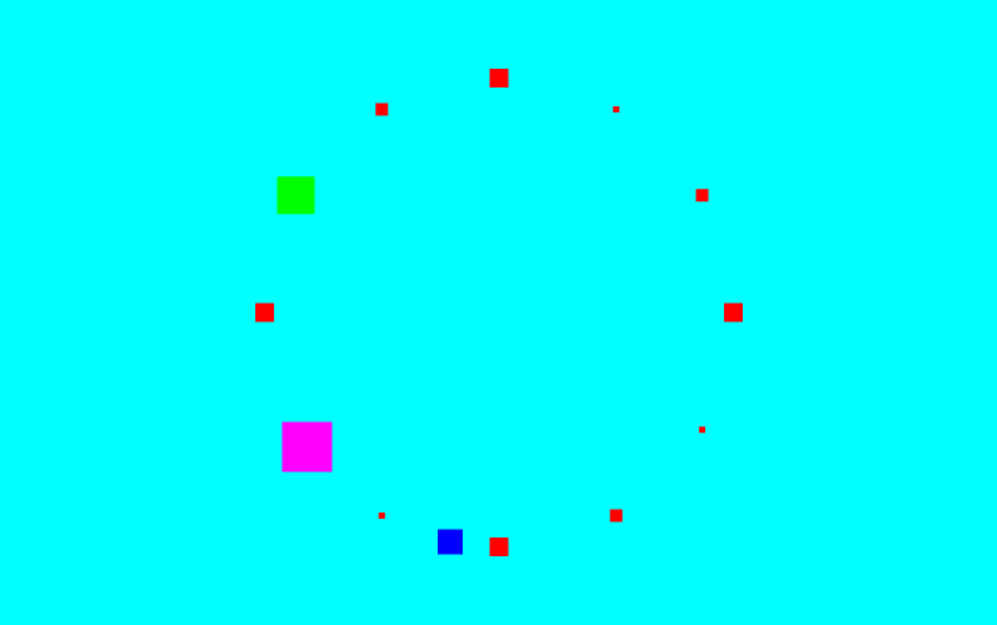
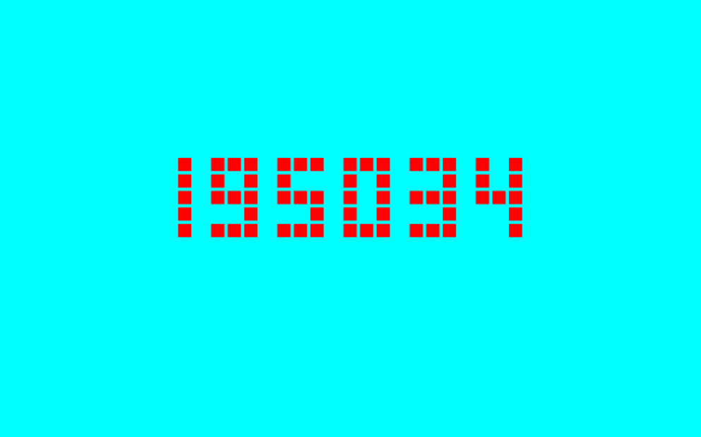

# web-rendering

"<em>If I had no data except a vertex id could I draw something interesting?</em>" - [webglfundamentals.org](https://webglfundamentals.org/webgl/lessons/webgl-drawing-without-data.html)  

Some 2D and 3D examples using **WebGL**.  

View [demo](https://jimj92120.github.io/web-rendering/).


---
## Examples

### Clock - [Example 3](./src/engine/examples/Example3.ts)  
      

### Digital clock - [Example 4](./src/engine/examples/Example4.ts)  
    

---
## Requirements

|              |         |
|--------------|---------|
| `node`       | `^14.0` |
| `npm`        | `^6.0`  |
| `typescript` | `^4.0`  |

---
## Project setup
```
npm install
```

### Compiles and hot-reloads for development
```
npm run serve
```

### Compiles and minifies for production
```
npm run build
```

### Run your unit tests
```
npm run test:unit
```

### Lints and fixes files
```
npm run lint
```

### Customize configuration
See [Configuration Reference](https://cli.vuejs.org/config/).
